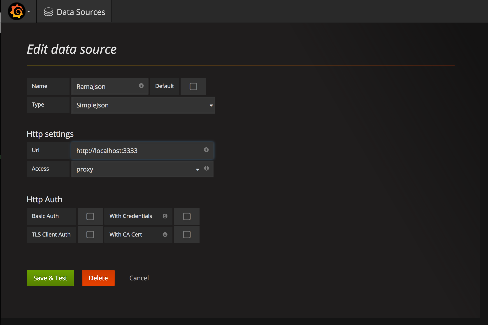
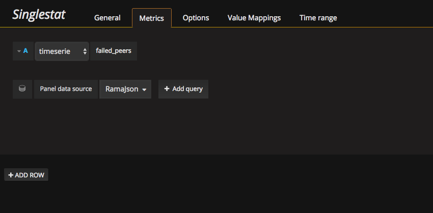
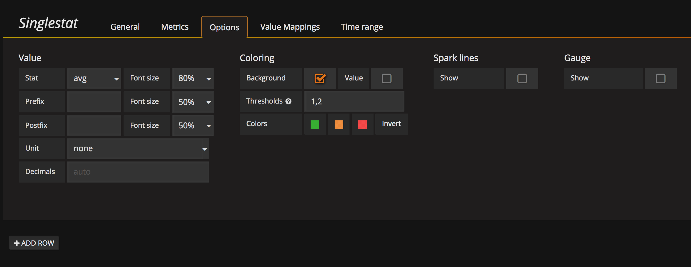

Overview
--------

This is an add on that uses the simple-json-datasource from Grafana to create a visual representation of netq checks.

# Launch simple-json-datasource on OOB server

Install dependencies:

    cumulus@oob-mgmt-server:~/monitoring-project/redis$ sudo apt-get install npm
    cumulus@oob-mgmt-server:~/monitoring-project/redis$ sudo apt-get install nodejs-legacy

# Install Fake-Simple-Jason-Datasource

https://github.com/bergquist/fake-simple-json-datasource

    cumulus@oob-mgmt-server:~/monitoring-project/redis$ npm install
    fake-simple-json-datasource@1.0.0 /home/cumulus/monitoring-project/redis
    +-- body-parser@1.16.0
    | +-- bytes@2.4.0
    | +-- content-type@1.0.2
    | +-- debug@2.6.0
    | | `-- ms@0.7.2
    | +-- depd@1.1.0
    | +-- http-errors@1.5.1
    | | +-- inherits@2.0.3
    | | +-- setprototypeof@1.0.2
    | | `-- statuses@1.3.1
    | +-- iconv-lite@0.4.15
    | +-- on-finished@2.3.0
    | | `-- ee-first@1.1.1
    | +-- qs@6.2.1
    | +-- raw-body@2.2.0
    | | `-- unpipe@1.0.0
    | `-- type-is@1.6.14
    |   +-- media-typer@0.3.0
    |   `-- mime-types@2.1.14
    |     `-- mime-db@1.26.0
    +-- express@4.14.1
    | +-- accepts@1.3.3
    | | `-- negotiator@0.6.1
    | +-- array-flatten@1.1.1
    | +-- content-disposition@0.5.2
    | +-- cookie@0.3.1
    | +-- cookie-signature@1.0.6
    | +-- debug@2.2.0
    | | `-- ms@0.7.1
    | +-- encodeurl@1.0.1
    | +-- escape-html@1.0.3
    | +-- etag@1.7.0
    | +-- finalhandler@0.5.1
    | | `-- debug@2.2.0
    | |   `-- ms@0.7.1
    | +-- fresh@0.3.0
    | +-- merge-descriptors@1.0.1
    | +-- methods@1.1.2
    | +-- parseurl@1.3.1
    | +-- path-to-regexp@0.1.7
    | +-- proxy-addr@1.1.3
    | | +-- forwarded@0.1.0
    | | `-- ipaddr.js@1.2.0
    | +-- qs@6.2.0
    | +-- range-parser@1.2.0
    | +-- send@0.14.2
    | | +-- debug@2.2.0
    | | | `-- ms@0.7.1
    | | +-- destroy@1.0.4
    | | `-- mime@1.3.4
    | +-- serve-static@1.11.2
    | +-- utils-merge@1.0.0
    | `-- vary@1.1.0
    `-- lodash@4.17.4
    npm WARN fake-simple-json-datasource@1.0.0 No repository field.
-
    cumulus@oob-mgmt-server:~/monitoring-project/redis$ sudo node index.js &
    Server is listening to port 3333
    cumulus@oob-mgmt-server:~/monitoring-project/redis$ ps -aux | grep index
    root     15924  0.0  0.3  52992  3840 pts/0    S    18:15   0:00 sudo node index.js
    root     15925  6.0  3.5 948308 36164 pts/0    Sl   18:15   0:00 node index.js
    cumulus  15931  0.0  0.2  16572  2040 pts/0    S+   18:15   0:00 grep --color=auto index

# Install simple-json-datasource on Grafana

https://grafana.net/plugins/grafana-simple-json-datasource/installation

The Simple JSON Datasource looks at a flat file that has json data encoding. In this environment, the file is called `./redis/series.json`.

    cumulus@oob-mgmt-server:~/monitoring-project$ sudo /usr/sbin/grafana-cli plugins install grafana-simple-json-datasource
    installing grafana-simple-json-datasource @ 1.2.4
    from url: https://grafana.net/api/plugins/grafana-simple-json-datasource/versions/1.2.4/download
    into: /var/lib/grafana/plugins
    ✔ Installed grafana-simple-json-datasource successfully
    Restart grafana after installing plugins . <service grafana-server restart>
-
    cumulus@oob-mgmt-server:~/monitoring-project$ sudo systemctl restart grafana-server.service

Grafana cli isn't part of the path, so it needs the full path to run:

    cumulus@oob-mgmt-server:~/monitoring-project$ grafana-cli plugins install grafana-simple-json-datasource

    Command 'grafana-cli' is available in '/usr/sbin/grafana-cli'
    The command could not be located because '/usr/sbin' is not included in the PATH environment variable.
    This is most likely caused by the lack of administrative privileges associated with your user account.
    grafana-cli: command not found

# Add simple-json-datasource as Datasource

# Create Panels that Graph the Data

